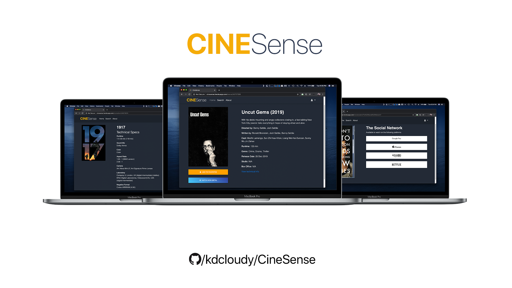

# CineSense



The ongoing implementation of CineSense, an online movie database application built using node.js and user preferences are recorded in a custom database using MongoDB Atlas.
Authentication handled using Passport.js

Movie data pulled through the OMdb API (key required, poster API is optional, paid.)

Watch (availability in streaming services like Netflix and Prime Video) data pulled through the uTelly API (key required)

Final deployable build: http://cinesense.herokuapp.com

Known Issues:
- Watch data mismatch for certain titles
- Posters missing for certain titles and in favourites page
- Watch data returns results only for Indian region
- ~No custom UI error pages or messages~

**Setup guide:**

After cloning the project, run the following command to install all dependencies (Mongoose, BodyParser, Request, Passport etc)
```
$ npm install
```

After setting up, issue your own API keys from OMDB, uTelly from RapidAPI and replace the constants in the app.js file
```
const API = 'INSERT API KEY'
const APIWatch = 'INSERT API KEY';
const APITech = 'INSERT API KEY';
```

The APITech constant is for the Technical Specs page, which is another API from the unofficial IMDB API, issued from RapidAPI itself. This feature is redundant for the most part and can be replaced with an in-house web scraping functionality from IMDB.

Finally, to connect to a database, you have two options:

**1)Locally hosted database**
For this, you need the latest version of MongoDB installed on your machine, and Mongoose correctly setup. 
Insert the following code to create and connect to a locally hosted database:
```
mongoose.connect("mongodb://localhost:27017/cinesense",{useNewUrlParser: true, useUnifiedTopology: true })
```

**2)Web hosted database**
For this, you must use MongoDB Atlas and create your own cluster. After setting it up, replace your server address with dbaddress constant in the app.js file
```
var dbaddress = 'INSERT MONGODB ATLAS'
mongoose.connect(dbaddress,{useNewUrlParser: true, useUnifiedTopology: true });
```

That's it, you're setup with CineSense, modify it all you want and create your own fork!
Feel free to send pull reqeusts if you wish to contribute.

Future enhancements include refactoring and porting the entire project to the free and fully featured TMDB API and adding Async for concurrent API requests. And also building a recommender system using Pandas and SciKit in Python for a content based or collaboratively filtered movie recommendation system, using a forked 5000 movie dataset as a training scheme. 

Contact me at @kdcloudy on the internet. 


